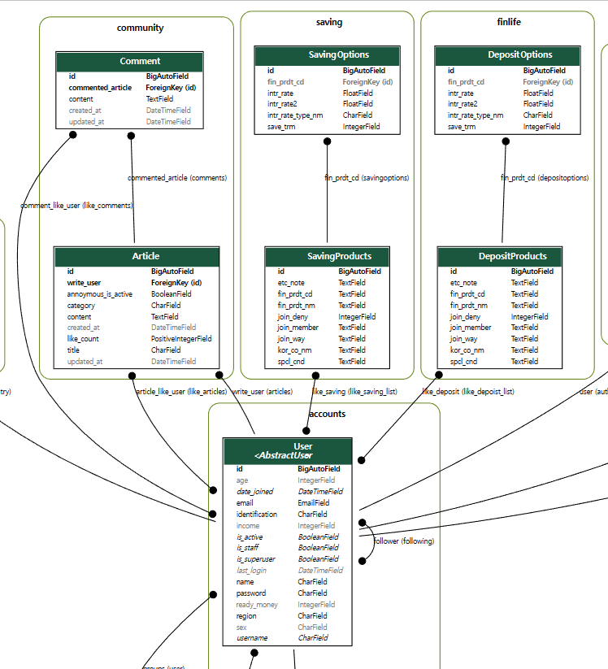

# 금융상품정보제공 웹 서비스 만들기

- 일시: 2023.5.17. - 2023.5.25.

<br/>

## 팀원

|이름 &nbsp;&nbsp;&nbsp;&nbsp;|&nbsp;&nbsp;업무 분담|
|:---:|:---|
|김영우|- 백엔드 80%, 프론트 20% <br/> - DB 모델 설계, 백엔드 로직 구현, 강화학습을 이용한 금융상품 추천 알고리즘 구현, 환율계산기, 카카오맵 은행찾기|
|박재영|- 프론트 80%, 백엔드 20% <br/> - 프론트 로직 구현, 화면 구성, 컴포넌트 구성, 카카오맵 은행찾기|

<br/>

## 목표 서비스 구현 및 실제 구현 정도

- 커뮤니티 중심의 금융 정보 서비스를 구현하고자 하였다.
- 자신과 비슷한 사람들이 가입한 상품, 자신의 취향에 맞는 상품을 추천받고, 커뮤니티를 통해 정보를 얻을 수 있도록 한다.


|번호|기능|상세설명|구현 정도|
|:---:|:---:|----|:---:|
|1|메인페이지|  | ⚫️⚫️⚫️⚪️⚪️ |
|2|회원커스터마이징|로그인, 로그아웃, <br/> 회원가입, 회원정보수정| ⚫️⚫️⚫️⚫️⚫️ |
| ||--추가 기능--||
| | |소셜 로그인| ⚪️⚪️⚪️⚪️⚪️ |
|3|예적금 금리비교|데이터 저장, 전체 조회, 상세 조회| ⚫️⚫️⚫️⚫️⚫️ |
| | |은행별, 가입 기간별 상품 검색, 필터| ⚪️⚪️⚪️⚪️⚪️ |
| ||--추가 기능--||
| | |금리별 정렬| ⚫️⚫️⚫️⚫️⚫️ |
| | |상품 정보 수정 시 이메일 발송| ⚫️⚫️⚫️⚫️⚫️ |
| | |이자계산기| ⚫️⚫️⚪️⚪️⚪️ |
| | |상품 몇 개 담아서 비교| ⚪️⚪️⚪️⚪️⚪️ |
|4|환율계산기|원화 -> 외화| ⚫️⚫️⚫️⚫️⚫️ |
| | |외화 -> 원화| ⚫️⚫️⚫️⚫️⚫️ |
|5|은행검색|검색어로 은행 검색하고 결과 목록 출력| ⚫️⚫️⚫️⚫️⚫️ |
|6|커뮤니티|게시판 CRUD| ⚫️⚫️⚫️⚫️⚫️ |
| | |댓글 CRUD| ⚫️⚫️⚫️⚫️⚫️ |
| | |유저별 권한 제한| ⚫️⚫️⚫️⚫️⚫️ |
| ||--추가 기능--||
| | |게시글 좋아요, 댓글 좋아요, 팔로우| ⚫️⚫️⚫️⚫️⚫️ |
| | |게시글 분류별 조회| ⚫️⚫️⚫️⚫️⚫️ |
| | |대댓글, 유저 업적, 뱃지 시스템| ⚪️⚪️⚪️⚪️⚪️ |
|7|프로필페이지|본인 정보 수정| ⚫️⚫️⚫️⚫️⚫️ |
| | |가입 상품 리스트 출력<br/>금리 그래프 출력| ⚫️⚫️⚫️⚫️⚫️ |
| | |금융 상품 추천| ⚫️⚫️⚫️⚫️⚫️ |
|8|예적금 정보|--추가 기능--||
| | |금융상품 즐겨찾기| ⚫️⚫️⚫️⚫️⚫️ |
| | |페이지네이션| ⚪️⚪️⚪️⚪️⚪️ |

<br/>

## ERD



<br/>

## 추천 알고리즘

1. 상위 10 % 유저들의 (주식, 채권, 대출, 현금성 자산) 포트폴리오를 이용하여 협업 필터링으로 나와의 취향 유사도 계산

2. 취향 유사도를 가중평균으로 반영하여 뽑은 상위 10명의 포트폴리오 비율 평균 도출 

3. 해당 포트폴리오를 바탕으로 자산 상위 10%에 비해 가장 부족한 포트폴리오 항목 추천

4. 해당 포트폴리오 항목이 현금성자산(예금, 적금) 인 경우 협업 필터링, 콘텐츠 필터링으로 예금 적금 추천 

5. `협업 필터링` : 나와 취향이 유사한 상위권 유저 들의 가중치를 반영하여 가중치가 높은 상품부터 추천 

6. `콘텐츠 필터링` : 내가 좋아한 유형의 컨텐츠들을 고려하여 비슷한 상품 추천 

7. 통합: 협업 필터링과 콘텐츠 필터링으로 각각 3개씩 총 6개의 상품을 추천하며 유저가 협업 필터링으로 추천된 상품을 선택하는지, 콘텐츠 필터링으로 추천된 상품을 선택하는지에 대한 정보 수집

8. 그 피드백을 바탕으로 협업 필터링과 콘텐츠 필터링의 비율 조정

<br/>

## 서비스 구현하는 과정 또는 코드 작성하는 과정에서 겪었던 시행착오, 해결했던 방법

1. 장고 auth의 기본 유저 필드(특히 비밀번호)의 유효성 검사 기준을 몰라서 사용자에게 정확한 유효 양식을 알릴 수 없었다.
   
    - `django-rest-auth`의 공식문서에는 관련 내용이 나오지 않았고 코드를 찾아봐야 했으나 다른 기능 구현을 우선적으로 해야 한다고 생각해 비밀번호 유효성 검사는 일단 몇 가지만 걸러냈다.

    - 여전히 사용자에게 어떤 적절한 알림 없이 가입이 안 되는 경우가 있다.

    - 자바스크립트의 `정규 표현식`을 이용해 비밀번호 유효성을 검사하였다.
    
    ```
    / 및 /는 정규식 패턴의 시작과 끝을 나타낸다.
    ^는 문자열의 시작을 나타낸다.
    $는 문자열의 끝을 나타낸다.
    (?=.*[A-Za-z])는 문자열에 적어도 하나의 알파벳 문자가 포함되어 있는지 확인 어서션
    (?=.*\d)는 문자열에 적어도 하나의 숫자가 포함되어 있는지 확인하는 또 다른 긍정 예측 어서션
    [A-Za-z\d]는 모든 알파벳 문자(대문자 또는 소문자) 또는 숫자와 일치합니다.
    {8,}은 이전 패턴(영숫자 문자 또는 숫자)이 8회 이상 발생해야 함을 지정한다.
    ```

2. 좋아요나 팔로우 등을 구현할 때, 좋아요/팔로우 여부는 서버를 통해 DB에 업데이트 했지만 웹페이지는 새로고침이 되기 전까지는 그것이 반영되지 않아 좋아요/팔로우 아이콘이 바뀌지 않았다.
   
    - 좋아요, 팔로우 버튼을 누를 때마다 새로고침이 되는 것은 낭비이고, 새로고침 시 화면이 다시 맨 위로 올라가 사용자의 편의성을 해치기 때문에 버튼을 눌렀을 때 새로고침하는 방식으로는 해결 방안으로 적절하지 않다고 판단했다.

    - 언젠가 페이지가 다시 렌더링될 때에는 DB에서 좋아요/팔로우 여부 정보를 받아와 렌더링되도록 되어있으므로, 처음 유저의 좋아요/팔로우 여부를 알았으면 페이지가 다시 로드되기 전까지는 좋아요/팔로우 클릭에 따라 그 여부를 바꾸어주어 그에 맞는 아이콘이 나타날 수 있도록 하면 된다고 생각했다.

    - 그래서 처음에 서버에서 데이터를 받아 렌더링할 때 좋아요/팔로우 여부를 컴포넌트의 `data`에 저장해놓고, 버튼을 누르면 true/false를 바꾸어서 `data` 내용이 바뀌고, 그에 따라 Vue의 컴포넌트가 다시 렌더링되어 버튼 내용이 바뀌도록 하였다.

3. 커뮤니티 기능에서 게시글 세부 내용을 보여줄 때, article을 store로부터 computed로 받아오도록 했더니 다른 세부 내용 페이지로 들어가면 그 이전 글이 먼저 렌더링되었다가 새로운 게 렌더링되는 현상이 발생했다.
  
   - store에 article의 내용을 저장해두고 데이터를 이용하다가 다른 세부 내용 페이지에 들어가서 article이 바뀌면 렌더링되도록 하려는 의도였는데, 그 이전 글이 먼저 보였다가 그 페이지의 글이 보이게 되어서 사용자 입장에서는 당황할 수 있는 상황이 나타났다.
  
   - 컴포넌트 data에 article을 초기값을 null로 해서 정의해두고, 라이프 사이클 훅으로 서버에서 데이터를 받아와 article 데이터를 갱신하기 전까지는 로딩 중임을 표시하는 화면이 나타나도록 수정하였다.

4. `getters`에 로컬 스토리지에 저장된 토큰 값을 가져오는 `token`을 정의하였더니 로그인-로그아웃 후 다시 로그인했을 때 토큰이 바로 업데이트 되지 않았다.
    
    - 토큰과 관련된 정보는 여러 컴포넌트에서 사용하고, 현재 사용자의 상태가 바뀌어 토큰 값이 바뀌면 그걸 반영해야 하므로 `getters`에 정의했다. 그러나 `token`이 필요해서 `getters`가 호출되기 전까지는 값이 갱신되지 않아서 로그아웃, 로그인 시 `token` 값이 바로 바뀌지 않아 기능에 문제가 생겼다.
    
    - 토큰 자체를 직접 이용하지 않고 로그인 여부(`isLoggedIn`) 판단, 서버 요청 시 header에 들어갈 내용(`authHeader`) 등에 이용되므로 `state`에 `token`을 정의하고, `getters`에 그 `token`을 기반으로 계산되는 `isLoggedIn`과 `authHeader`를 정의하여 사용했다.

5. 다른 사람의 프로필 페이지를 보다가 내 프로필로 바로 이동했을 때, 프로필의 내용이 바뀌지 않았다.
    
    - Vue가 `ProfileView` 컴포넌트를 재사용해서 라이프 사이클 훅이 호출되지 않아서 바뀌어야 할 데이터를 불러오지 않았기 때문에 발생한 문제였다.
    
    - 수업 당시에 이런 경우 사용할 수 있는 라우터 가드에 대해 배운 것을 떠올리고 컴포넌트 재사용시 새로운 props, params 데이터를 받을 때 호출되는 `beforeRouteUpdate`를 이용해서 새로운 프로필 데이터를 갱신해주었다.

6. 가독성을 위해 store를 모듈로 나누었더니 컴포넌트에서 `mapState`로는 모듈의 state에 들어있는 데이터를 바로 가져올 수 없었다.
  
    - 모듈별로 state를 구분할 수 있는 방법을 찾아보았더니 모듈의 `namespace`를 이용하는 방법이 있었다.
  
    - 그런데 `mapGetters`의 경우, `namespace`를 이용하지 않을 때에도 모듈의 getters의 값을 가져오는 게 가능했는데 `namespace`를 이용하니 getters에도 이름을 지정해줘야 했다.
  
    - 이미 작성한 코드들이 많아서 수정하기 어려운 상황이었기 때문에, `namespace`를 쓰지 않고 state의 값을 getters로 받아서 컴포넌트에서는 `mapGetters`로 가져다 사용하였다.

<br/>

## 기술적으로 아쉬웠던 부분, 향후 공부할 내용

## 프로젝트 진행하면서 느낀점, 후기 그리고 다음 프로젝트 때 잊어 버리지 말고 고려할 사항

- ERD 설계를 확실하게 하지 않고 프로젝트를 진행하여 모델 수정을 많이 하게 되어서 개발에 시간이 더 소요된 것 같다. 기획 시 시간이 더 걸리더라도 세세한 부분까지 정하고 프로젝트에 착수하는 것이 시간 절약에 도움이 될 것 같다.

- 명세에 있으나 잊어버리고 넘어간 부분이 있었다. 플로우에 할일들을 정리해놓고 시작하긴 했으나 그날의 할일을 정리하는 과정에서 누락된 것 같다. 다음에는 눈에 잘 들어오도록 차트 등을 이용해 할일을 작성하고, 정리한 그 내용을 다시 보면서 단기 계획을 세우고 진행 상황을 적어야 정보가 분산되어 누락되는 일을 막을 수 있을 것이다.

- 깃에 익숙치 않아서 협업을 효율적으로 하지 못했다. 이번 프로젝트에서는 팀원끼리 백엔드와 프론트엔드 중 한쪽을 거의 대부분 맡아서 진행했기에 큰 문제가 없었지만, 여러 명이서 같은 파일을 수정하는 일이 많아질 경우 깃의 사용은 필수라고 생각한다. 미리 깃의 브랜치 생성, 병합 기능과 버전 관리 기능에 익숙해질 필요가 있다.
